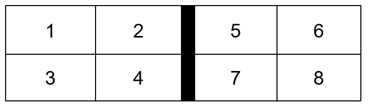

## Overview
The ratrixCam system is an inexpensive, bare-bones open-source hardware and software package designed to record video 24 hours a day 7 days a week for at least 1 week continuously, with the minimum possible frame drops within videos or gaps between videos. It was developed for in-home-cage animal behavior monitoring, but could be used in any application requiring continuous uninterrupted video recording. The code provides a minimal graphical user interface that allows the user to monitor the camera status and session statistics during the run. The code is currently verified to support up to 8 cameras streaming at 30fps, 640x480p. 

We have developed and tested this code on specific hardware (see Setup Instructions for full specifications). Some details relevant to achieving robust performance were hardware-specific.  In principle this code could work on any operating system, computer platform, or USB camera type, but in practice any of these generalizations will require additional testing and likely tweaking.

### System Operation in Brief
- Attach an empty SSD drive
- Launch software
- Click "Start Recording" 
  (Camera images will be displayed while recording) 
- Every week or so:
  - Click "Stop Recording"
  - Swap out full SSD drive for empty one
  - Click "Start recording"
  - Transfer videos off the full SSD drive

## Operation Instructions in Detail
Double click on `cam_start.scpt` to open it, and click ‘play’ to launch ratrixCam. (Alternatively, the command found within that script can be typed directly into a terminal window).

First the Configuration Editor will open, displaying the name of the study and a description of each camera view, which are loaded from the `config.json` file. The labels are arranged on the screen in the position corresponding to where the camera views will appear in the video acquisition monitor. If you want to change the labels, we will discuss editing them later.

When you click Start Recording, the configuration editor closes and a Monitor Window opens to monitor video acquisition status. By default, the cameras 1-8 appear in the following layout, which reflects the use case where the cameras are used to monitor two adjacent cages or rigs, four cameras per animal.

 

As each camera connects, its current view will start to update in the display; it should take 15-60 seconds for all 8 cameras to start. Note that all cameras must be present before the cameras will launch. By default, videos are recorded at 30fps but the displayed images update once per second.  To the right of the camera views, there are text fields indicating basic session information. You may have to resize the window to see everything. 

While the cameras are starting up, locate the Terminal Window and move it to where you will be able to watch the messages that scroll by. If there are warnings or errors they will appear here.

#### Changing the labels
The “study name” is appended to the start of every filename and overlaid on every video frame; it should be a short string identifying the overall study. The “camera names” are also included in video filenames and overlaid on every frame; these should be short descriptions of the distinct fields of view. The labels are meant to be fixed for the duration of a study. Timestamps will be added to filenames and overlaid on video frames to distinguish individual runs and slices. Whenever you start a recording session you can verify that overlaid labels and camera views match. Cameras should always appear in the same positions, as long as they remain plugged into the same USB hub ports.
When setting up a new study, launch the cameras and verify which camera’s field of view appears at each position on the display. Then stop the run, relaunch ratrixcam, and edit the labels in the Configuration Editor to reflect this information. You must click “save changes” for changes to take effect. This action also updates your `config.json` file, so the new labels will repopulate automatically in future runs.  Alternatively, you can edit these within the `config.json` file directly in any text editor. The study name is set by the "study_label" property, and the camera names are set by the “name” property of each camera within "cameras". 

### What happens during a run

Once the cameras have been launched, the system can record continuously indefinitely, until the storage media is full. During the run, the Monitor Window will update each camera’s view once per second, as well as displaying textual status information. Each video stream will be saved as many separate, short video files (“slices”), whose duration is specified in the `config.json` file. We recommend using 600s (10 min) slices for data acquisition. 

We designed and tested the system for week-long continuous recording sessions from 8 cameras recording at 640x480 resolution at 30fps, for which a 4TB external SSD drive was sufficient to hold one week of video output. In our conditions a MacMini2 could run at least two of the 8 cameras at 780p resolution stably (accumulating data at 1.5x the rate).

To end a recording session, click the Stop Recording button. Watch the Terminal Window for messages as a graceful shutdown and cleanup is performed. When the terminal indicates shutdown is complete, you can export its contents to a text file to retain a detailed log of events and errors during the session. You can then swap the filled external drive for an empty one and start a new run. The gap in recording time can be as short as one minute. 

### Failure recovery

It should be exceedingly rare for cameras to drop out during a run. Nevertheless, if a camera should drop out during a run, the system will continue to function as well as possible. The Monitor Window will indicate that the camera is offline, save the partial video file, and then continually attempt to restart the camera. There will be a gap in the video record for the camera that went down until it restarts, but others will not be affected. All these events are logged in the Terminal Window. If more than one camera goes down at the same time, the system will wait until all cameras are detected again before any of them attempt to restart. This prevents them from starting up and stealing another camera's ID slot.

If the output drive fills up during a session, the software will continue to re-try saving the files until the session is ended. For this reason, if you hot-swap a new drive without stopping the software, all the untransferred files should then be saved normally. However, if both the external output drive and internal hard drive fill up during a run, all video from that time on will be lost. Therefore, we recommend keeping at least 1TB free on the Mac’s internal hard disk.

Temporary video files accumulate in the temporary folder on the hard drive until they are transferred to the output drive. When you stop recording, the shutdown sequence will continue attempting to write the unsaved files, but if this fails enough times it will eventually give up and kill any unsuccessful file transfer requests. The Terminal Window will show error messages for failed file transfers. In this case, any un-transferred video files can be manually rescued from the temporary folder. 

If the program hangs (Stop Recording button is not responding) you can close the terminal window to stop the run. You can then manually copy the un-transferred files from the temporary folder.

Except when the external drive is full, hot swapping of the external drive during a run is not recommended. However, it would in fact probably be fine. If you unplug media in the middle of writing a file to the external drive, it will still most likely recover gracefully and re-attempt to transfer the file to the new drive when it connects. Nevertheless, we provide no guarantees.

### Settings in the config file
#### Number of Cameras 
The code will only start recording after it detects (at least) the expected number of cameras. The default configuration file presumes 8 cameras. Therefore, if you want to run the system with fewer than 8 cameras, you must edit the config file. Each camera is defined by a block such as:
`
{
      "name": "cam1",
      "row": 1,
      "col": 1
    }
`

Note that the cameras will be launched in the order listed, but you can include whichever subset you want. For example, if camera #7 is temporarily broken you can delete the cam7 block, and the other cameras will retain their usual names and display positions. But the computer must detect (at least) as many connected cameras as you have entries in the config file before the cameras will launch.  If more are connected, it will use the first N it sees.

The code supports recording of up to eight cameras, and will behave strangely if you define more than eight. 

#### Settings shared by all cameras in a given run 
| Setting | Description |
| ----------- | ----------- |
| save_path       | folder where output videos will be saved |
| temp_path       | folder where temporary video files will be staged |
| blank_image     | image file to display when a camera is offline |
| stills_path     | folder where the most recent displayed frame is kept |
| rack_name       | string uniquely identifying the recording system instance  |
| study_label     | string identifying the study or experiment (used in labels and filenames) |
| time_slice      | duration in seconds of each video file |
*Advanced settings*
| default_fps     | frames per second, if not otherwise specified |
| default_width   | frame width in pixels, if not otherwise specified |
| default_height  | frame height in pixels, if not otherwise specified |
| default_cam_exposure   | duration the "shutter" is open, if not otherwise specified  |
| preview_interval       | interval in seconds between updates of displayed image |
| codec                  | video codec |
| video_ext              | video file extension |
 
#### Settings for individual cameras 
| Setting | Description |
| ----------- | ----------- |
| name       | string associated with the camera (used in labels, filenames) |
| row        | row in display where camera image is shown (valid values 1 or 2) |
| col        |  column in display where camera image is shown (valid values 1,2,4,5) |
*Overriding defaults*
| fps        |  frame rate  |
| width      |  frame width in pixels |
| height     |  frame height in pixels |
| exposure   |  duration the "shutter" is open each frame  |

There is little to no error checking on these settings. The user is responsible for not assigning two camera images to the same display location, only selecting camera settings that are supported by the camera they are using, and so forth.

*Unsupported options*
The following config settings are obligatory because these functionalities are not yet implemented
`  "recording_audio": false,
  "recording_ttl": false
 ` 

## Technical Details
Information below here is not necessary to use the system, but may be useful to users who have exacting technical requirements, for debugging system failures, or for developers wanting to modify the code.

### Temporary and final files

The videos are initially streamed to temporary files in the temporary directory specified in the config file. This directory should be on the internal hard drive of the mac; we recommend a folder on the desktop. The internal HD is used because the transfer speed or write speed of an external drive might not be able to keep up with all 8 cameras in real time.  

When a time slice ends, this temporary file is closed, and a separate parallel process is launched to transfer it to the output drive (typically an external hard drive, to allow for media swapping).  When the file has been confirmed to be successfully transferred, the temporary file is deleted from the hard drive. Therefore the hard drive does not need to have enough capacity for the entire recording session’s videos.  

The temporary folder should be empty of video files when the session ends. However, if any videos failed to transfer for any reason, such as the output drive being full, the temporary files will stay in the temporary folder. Our routine workflow is to manually move the temporary folder onto the portable drive just before ejecting it from the Mac. If the temporary folder is empty as expected, this action takes no time and cleans up the desktop; but if any files were not transferred, they will be transferred at that time.

### Video transfer and processing steps

The cameras have on-board hardware to compress individual video frames to mjpegs as they are captured. These frames are written directly to the temporary video files. This makes it possible to keep up with the bandwidth of 8 cameras in real time. After a video file is closed, we launch a separate process to transfer the file to the output drive. The ratrixcam code is smart about monitoring these processes and cleaning up after them, so we should not leave behind orphan processes.

However, within-frame compression is very inefficient, so the video files are large. Therefore, after a recording session ends, we recommend further compression before archiving. This places high demands on the CPU and RAM, and can take more time to compress a video than the duration of the video. Therefore it can’t be run on the Mac during recording. 

On a separate machine dedicated to this purpose, we compress videos with an inter-frame compression algorithm that achieves much higher compression without noticeable loss of quality (“visually lossless”). This algorithm is computationally intensive and not supported by the Mac’s dedicated video processor. First we run a lightweight motion detection algorithm to identify whether a video contains significant motion. Videos without motion can be compressed at very high compression ratios. The code for this is available in a separate github repository.

#### Transcoding on the fly
We did implement code for compressing the videos on the fly using ffmpeg but this feature is currently disabled. To avoid interfering with acquisition we used the Mac’s dedicated hardware for video processing, instead of the Mac’s CPU. This is fast and does not interfere with ongoing video acquisition, but it does not compress the files very efficiently, and introduces timing instability we didn’t find worth solving. If you want to try getting it working on your setup, look in the file `ratrix_cam_server.py` for the disabled code.

### Timing Issues

There should not be any dropped frames within videos or unrecorded gaps between video files; this was a primary functional specification for developing this system. However, the timestamps on video frames are only approximate. The timestamps indicate when the frame was read from the buffer, which is usually but not always within 1-2ms of when it was written to the buffer by the camera. The frame number overlaid on each frame is the definitive indicator of the passage of time since a video stream opened. 

The cameras we are using run at only approximately the advertised frame rate. The breaks between video slices are determined by the system clock, not the number of frames.  Therefore if you specify 30fps and 600s slices, you may not get exactly 18,000 frames per video. But you should get close to the same number of frames in each video, and this should be very close to 10 minutes in duration. However, video players and file systems will indicate the “duration” of the video by dividing the number of frames by the nominal (specified) frame rate, making it appear that the video was cut short, even though it was not.

For example, if the true frame rate of a camera is 29fps, your 600s videos will have 29*600=17,400 frames +/-1, and your video player or file system will probably tell you the video is 17,400/30 = 580s in duration. If you want to verify there is no gap between videos, check the frame numbers. A single dropped frame causes the camera to shut down and re-launch. All such events are logged in the Terminal Window. Frame numbers restart at 0 every time a camera is launched or re-launched. 

Timestamp inaccuracies (i.e. uneven delays in capturing frames from the buffers) are common in the first few minutes of a session due to the high load on system resources during startup, and can occur any time the Mac’s resources are stressed. Although the video is actually fine, with no missing frames, the overlaid times may be off. To minimize this, avoid using any other USB-connected devices on the Mac (use a bluetooth mouse and keyboard); avoid running any other programs on the Mac during recording; disable automatic updates, do not install security software, keep the Mac in airplane mode by default. You can connect to the network through a secure internal network server when it is necessary to go online.

### Capacity limitations
The graphical interface presumes a maximum of 8 cameras; that code would need to be generalized to support any more than this number. However, the code for recording the videos itself has no upper limit on the number of cameras it will attempt to record simultaneously. At some point the hardware would not be able to keep up with the data stream; we have not tested this practical limit.

The limits on the maximum number of cameras and maximum resolution of cameras could probably be improved further if you are willing to dig into the code. We had to add timeouts and/or multiple retries in several places to prevent failures due to race conditions. We didn’t solve this in a general way, we just found values that are sufficient for the system to be reliable within the advertised specifications.

So if you want to try pushing the system beyond those specs, go ahead and try. You will know you’re in trouble when you start getting copious error messages in the terminal, including cameras frequently failing to capture a frame and shutting down, or files repeatedly failing to write and the GUI becoming non-responsive. You can attempt to remedy this by increasing the wait times or number of retries within the Python code.

The capacity of the USB bus could be a hard limiting factor, but this is probably not the constraint currently.

