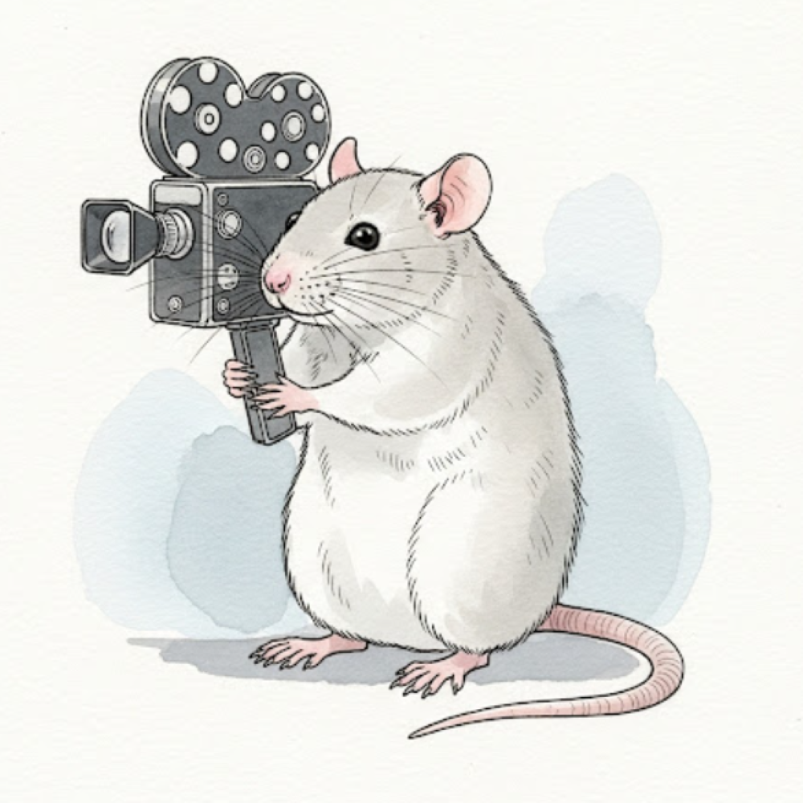

## Overview
 The ratrixCam system is an inexpensive, bare-bones open-source hardware and software package designed to record video 24 hours a day 7 days a week for at least 1 week continuously, with the minimum possible frame drops within videos or gaps between videos. It was developed for in-home-cage animal behavior monitoring, but could be used in any application requiring continuous uninterrupted video recording. The code provides a minimal graphical user interface that allows the user to monitor the camera status and session statistics during the run. The code is currently verified to support up to 8 cameras streaming at 30fps, 640x480p. 

See the [User Manual](./docs/UserManual.md) and [Setup Instructions](./docs/SetUpInstructions.md) for more information.

Project started by Blake Bruell and Pamela Reinagel 2025

With support from the [NIH BRAIN Initiative](https://braininitiative.nih.gov/) and [NINDS](https://www.ninds.nih.gov/) 1R34NS132037-01
